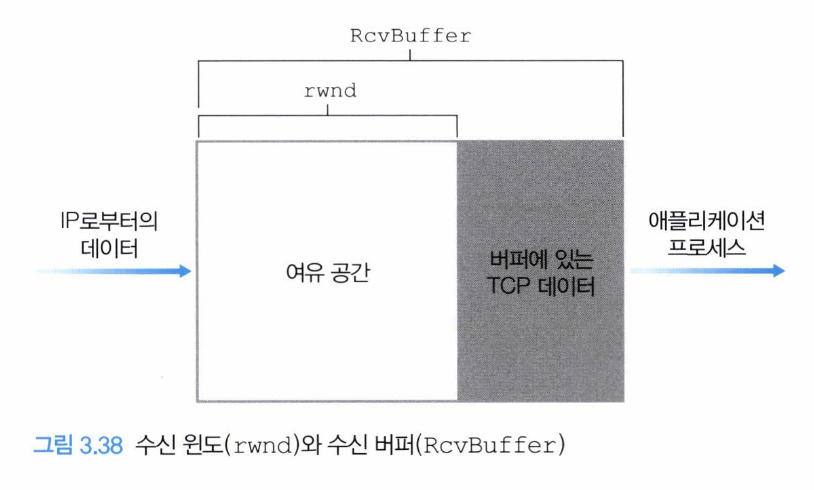

# TCP의 흐름 제어란?

TCP의 흐름 제어는 **송신자가 수신자의 처리 능력보다 빠르게 데이터를 보내서 수신 버퍼가 넘치는 상황을 막는 기능**이다.
TCP는 신뢰성 있는 바이트 스트림을 제공해야 하므로, 수신자가 아직 처리하지 못한 데이터가 버퍼에서 사라지면
TCP의 기본 목표인 안정성과 순서 보장이 깨질 수 있다. 따라서 TCP는 수신자의 버퍼 상태를 송신자에게 알려주고,
송신자가 그 범위 안에서만 데이터를 보내도록 조절한다.

## 1. 왜 흐름 제어가 필요한가?

TCP 수신자는 연결마다 수신 버퍼를 가진다. 네트워크에서 도착한 TCP 세그먼트의 데이터는 먼저 이 수신 버퍼에 저장되고,
이후 애플리케이션이 버퍼에서 데이터를 읽어 간다.

문제는 **네트워크로 데이터가 도착하는 속도**와 **애플리케이션이 데이터를 읽는 속도**가 항상 같지 않다는 점이다.
만약 송신자가 빠르게 데이터를 보내는데 수신 애플리케이션이 천천히 읽는다면, 수신 버퍼에 데이터가 계속 쌓인다.
이 상태가 계속되면 버퍼가 가득 차고, 오버플로우가 발생할 수 있다.

흐름 제어는 이 문제를 막기 위해 송신자의 전송량을 수신자의 남은 버퍼 공간에 맞춘다.

## 2. 흐름 제어와 혼잡 제어의 차이

흐름 제어와 혼잡 제어는 모두 송신자의 전송 속도에 영향을 주지만, 해결하려는 문제가 다르다.

- **흐름 제어**: 수신자의 버퍼가 넘치지 않도록 송신량을 조절한다.(수신자 상태)
- **혼잡 제어**: 네트워크 내부의 라우터나 링크가 과부하되지 않도록 송신량을 조절한다.(네트워크 상태)

## 3. receive window(rwnd)

TCP는 흐름 제어를 위해 **receive window(rwnd)** 값을 사용한다. rwnd는 수신자가 송신자에게 알려주는 값이며,
의미는 **현재 수신 버퍼에 남아 있는 여유 공간**이다.

수신자는 자신이 보내는 TCP 세그먼트의 윈도 필드에 rwnd 값을 담아 송신자에게 전달한다.
TCP는 전이중(full-duplex) 통신이므로 연결의 양쪽 호스트가 각각 데이터를 보내고 받을 수 있으며, 각 방향에 대해 rwnd가 존재할 수 있다.



## 4. 수신자 측 변수

수신자 입장에서 흐름 제어를 이해하려면 다음 변수를 보면 된다.

- **RcvBuffer**: 수신자에게 할당된 수신 버퍼의 전체 크기
- **LastByteRead**: 애플리케이션이 수신 버퍼에서 읽어 간 마지막 바이트 번호
- **LastByteRcvd**: 네트워크에서 도착하여 수신 버퍼에 저장된 마지막 바이트 번호

**수신 버퍼에 아직 남아 있는 데이터의 양**은 다음과 같다.

```text
LastByteRcvd - LastByteRead
```

수신 버퍼는 이 값보다 커야 한다.

```text
LastByteRcvd - LastByteRead <= RcvBuffer
```

따라서 현재 수신 버퍼의 남은 공간인 rwnd는 다음과 같이 계산된다.

```text
rwnd = RcvBuffer - (LastByteRcvd - LastByteRead)
```

애플리케이션이 데이터를 빨리 읽으면 `LastByteRead`가 증가해서 rwnd가 커지고,
송신자가 보낸 데이터가 많이 도착하면 `LastByteRcvd`가 증가해서 rwnd가 작아진다.

## 5. 송신자 측 변수

송신자는 수신자가 알려준 rwnd를 보고 아직 확인 응답을 받지 못한 데이터의 양을 제한한다.

송신자 입장에서 중요한 변수는 다음과 같다.

- **LastByteSent**: 송신자가 마지막으로 보낸 바이트 번호
- **LastByteAcked**: 송신자가 ACK를 통해 확인받은 마지막 바이트 번호

**아직 ACK를 받지 못한 데이터의 양**은 다음과 같다.

```text
LastByteSent - LastByteAcked
```

송신자는 이 값이 수신자가 광고한 rwnd를 넘지 않도록 해야 한다.

```text
LastByteSent - LastByteAcked <= rwnd
```

이 조건을 지키면 송신자는 수신자의 남은 버퍼 공간보다 많은 데이터를 밀어 넣지 않게 된다.

## 6. rwnd가 0이 되는 경우

수신 버퍼가 가득 차면 수신자는 더 이상 데이터를 받을 수 없으므로 송신자에게 rwnd = 0을 알린다.
이를 받은 송신자는 새로운 데이터를 더 보내지 않고 대기한다.

그런데 여기서 문제가 생길 수 있다. 이후 수신 애플리케이션이 버퍼의 데이터를 읽어서 다시 공간이 생기더라도,
그 사실을 알리는 윈도우 갱신 세그먼트가 유실되면 송신자는 여전히 rwnd = 0이라고 생각하고 계속 멈춰 있을 수 있다.

이런 교착 상태를 막기 위해 TCP는 zero-window probe 방식을 사용한다. 송신자는 수신 윈도우가 0이더라도 완전히 멈추지 않고,
일정 시간이 지나면 아주 작은 세그먼트, 보통 1바이트 데이터를 보내 수신자의 현재 윈도우 상태를 다시 확인한다.

수신자는 이 probe에 대한 응답으로 현재 rwnd 값을 담은 ACK를 보낸다. 만약 여전히 버퍼가 가득 차 있다면 다시 rwnd = 0을 알리고,
공간이 생겼다면 새로 열린 윈도우 크기를 알려준다.

이를 통해 송신자는 윈도우 갱신 세그먼트가 유실되더라도 영원히 멈춰 있는 상황을 피할 수 있다.
